# � Solana Pay Checkout Widget

<div align="center">


**A seamless Web3 payment solution that bridges traditional payments with Solana blockchain**

[� Live Demo](http://solana-pay-widget.vercel.app/) 
</div>

---

## ✨ Features

<table>
<tr>
<td width="50%">

### 🌟 **For Merchants**
- ⚡ **Quick Setup** - Get started in under 5 minutes
- 🎯 **Flexible Integration** - React/Typescript component
- 💰 **Payment Support** - Solana Pay - SOL, USDC, USDT
- 🔐 **Secure** - Non-custodial, secure by design

</td>
<td width="50%">

### 🎁 **For Customers**
- 📱 **Mobile-First** - QR code payments for mobile wallets
- ⚡ **Instant Settlements** - Sub-second transaction confirmations
- 🔗 **Multiple Wallets** - Phantom, Backpack, Solflare support
- 💳 **Fallback** - Wallet & QR code payments
</td>
</tr>
</table>

---

## 🚀 Quick Start

### 1️⃣ Installation

```bash
npm install solana-pay-widget
# or
yarn add solana-pay-widget
```

### 2️⃣ Basic Usage

```tsx
import { CheckoutWidget, WalletConnectionProvider } from 'solana-pay-widget';
import 'solana-pay-widget/dist/index.css';

function App() {

  return (
    <WalletConnectionProvider rpcEndpoint='https://api.devnet.solana.com'> 
        <CheckoutWidget
          checkoutId="demo_checkout_123"
          merchantWallet="4rbzcZsLxEefKdyho3U2dc5tfKUMdSM4vyRQhAkL4EHX"
          amount={0.001}
          currency="SOL"
          productName="Premium Subscription"
          description="Monthly premium subscription with all features"
          isOpen={true}
          onClose={() => {}}
          onSuccess={(txnId) => {}}
          onError={(err) => {}}
        />
      </WalletConnectionProvider>
  );
}
```

### 3️⃣ Advanced Configuration

```tsx
<CheckoutWidget
  checkoutId="demo_checkout_123"
  merchantWallet="4rbzcZsLxEefKdyho3U2dc5tfKUMdSM4vyRQhAkL4EHX"
  amount={0.001}
  currency="SOL"
  productName="Premium Subscription"
  description="Monthly premium subscription with all features"
  isOpen={true}
  onClose={() => {}}
  onSuccess={(txnId) => {}}
  onError={(err) => {}}
/>
```

---

## 🏗️ Architecture Overview

```mermaid
graph TB
    A[👤 User] -->|Creates Payment| B[🛒 Checkout]
    B --> C[💳 Payment Method]
    C -->|Solana Pay| D[🔗 Solana Blockchain]
    D -->|Verify| F[⚡ Backend API]
    F -->|Update Status| G[✅ Order Complete]
    F -->|Success Return| H[📧 You can store TxnId in DB]
```



---

### Core Components

#### `<CheckoutWidget />`

| Prop | Type | Required | Description |
|------|------|----------|-------------|
| `checkoutId` | `string` | ✅ | Unique checkout identifier for tracking |
| `merchantWallet` | `string` | ✅ | Merchant's Solana wallet address (recipient) |
| `amount` | `number` | ✅ | Payment amount (e.g., 0.001 for SOL) |
| `currency` | `'SOL' \| 'USDC' \| 'USDT'` | ✅ | Payment currency |
| `productName` | `string` | ✅ | Product/service name shown in widget |
| `description` | `string` | ❌ | Product description |
| `theme` | `'light' \| 'dark' \| 'auto'` | ❌ | Widget theme (default: 'light') |
| `enableNftReceipt` | `boolean` | ❌ | Enable NFT receipt minting (not implemented) |
| `webhookUrl` | `string` | ❌ | Payment webhook URL (not implemented) |
| `onSuccess` | `(txId: string) => void` | ❌ | Success callback with transaction ID |
| `onError` | `(error: Error) => void` | ❌ | Error callback |
| `onClose` | `() => void` | ❌ | Close callback |
| `className` | `string` | ❌ | Custom CSS class for styling |
| `isOpen` | `boolean` | ✅ | Control widget modal visibility |

#### `<WalletConnectionProvider />`

| Prop | Type | Required | Description |
|------|------|----------|-------------|
| `rpcEndpoint` | `string` | ❌ | Solana RPC endpoint (default: devnet) |
| `children` | `ReactNode` | ✅ | Child components |

**Supported Wallets:**
- 🦊 Phantom
- ☀️ Solflare
- 🅰️ Alpha Wallet

---

## 🌐 Network Configuration

### Devnet (Testing)
```tsx
<WalletConnectionProvider rpcEndpoint='https://api.devnet.solana.com'>
  <CheckoutWidget
    merchantWallet="4rbzcZsLxEefKdyho3U2dc5tfKUMdSM4vyRQhAkL4EHX"
    // ... other props
  />
</WalletConnectionProvider>
```

### Mainnet (Production)
```tsx
<WalletConnectionProvider rpcEndpoint='https://api.mainnet-beta.solana.com'>
  <CheckoutWidget
    merchantWallet="YOUR_MAINNET_WALLET_ADDRESS"
    // ... other props
  />
</WalletConnectionProvider>
```

**⚠️ Important Notes:**
- Widget automatically uses appropriate token addresses based on network
- USDC/USDT payments require token accounts (automatically created if needed)
- Always test on devnet before deploying to mainnet

---

## 💳 Payment Methods

### SOL Payments
- Direct wallet-to-wallet transfers
- Minimum amount: 0.000001 SOL
- Includes transaction fee estimation

### Token Payments (USDC/USDT)
- Requires associated token accounts
- Automatic token account creation for recipients
- 6 decimal precision for both USDC and USDT

### QR Code Payments
- Mobile wallet compatible
- Real-time transaction polling
- Automatic payment verification

---

## 🔧 Error Handling

The widget includes comprehensive error handling:

```tsx
const handleError = (error) => {
  switch(error.message) {
    case 'Insufficient SOL balance':
      // Handle insufficient funds
      break;
    case 'Transaction was cancelled':
      // Handle user cancellation
      break;
    case 'Network error':
      // Handle connection issues
      break;
    default:
      // Handle other errors
  }
};
```

**Common Error Types:**
- `Insufficient funds` - User needs more SOL/tokens
- `Token account not found` - User needs to create token account
- `Transaction was cancelled` - User rejected transaction
- `Network error` - Connection or RPC issues

---

## 📱 QR Code Payment Flow

1. **QR Generation** - Secure Solana Pay URL created
2. **Mobile Scan** - User scans with mobile wallet
3. **Transaction** - Payment processed on blockchain
4. **Verification** - Auto-polling confirms payment
5. **Completion** - Success callback triggered

**QR Code Features:**
- Auto-generated reference for tracking
- Error correction for reliable scanning
- Timeout after 5 minutes
- Real-time status updates

---

## 🎨 Custom Styling

```tsx
<CheckoutWidget
  className="my-custom-checkout"
  theme="dark"
  // ... other props
/>
```

```css
.my-custom-checkout {
  border-radius: 20px;
  box-shadow: 0 10px 30px rgba(0, 0, 0, 0.2);
}

.my-custom-checkout .sp-checkout-header {
  background: linear-gradient(135deg, #667eea 0%, #764ba2 100%);
}
```

**Available CSS Classes:**
- `.sp-modal-overlay` - Modal backdrop
- `.sp-modal-container` - Main modal container
- `.sp-checkout-header` - Header section
- `.sp-qr-payment` - QR code container
- `.sp-wallet-payment` - Wallet payment section
