# � Solana Pay Checkout Widget

<div align="center">


**A seamless Web3 payment solution that bridges traditional payments with Solana blockchain**

[� Live Demo](#) • [📖 Documentation](#) • [🛠️ API Reference](#) • [💬 Discord](#)

</div>

---

## ✨ Features

<table>
<tr>
<td width="50%">

### 🌟 **For Merchants**
- ⚡ **Quick Setup** - Get started in under 5 minutes
- 🎯 **Flexible Integration** - React component or iframe embed
- 💰 **Multi-Payment Support** - Solana Pay + traditional methods
- 📊 **Real-time Analytics** - Track payments and performance
- 🔐 **Secure** - Non-custodial, secure by design

</td>
<td width="50%">

### 🎁 **For Customers**
- 📱 **Mobile-First** - QR code payments for mobile wallets
- ⚡ **Instant Settlements** - Sub-second transaction confirmations
- 🔗 **Multiple Wallets** - Phantom, Backpack, Solflare support
- 💳 **Web2 Fallback** - Card/UPI payments via Stripe/Razorpay
- 🎫 **NFT Receipts** - Optional proof-of-purchase NFTs

</td>
</tr>
</table>

---

## 🚀 Quick Start

### 1️⃣ Installation

```bash
npm install @solana-pay/checkout-widget
# or
yarn add @solana-pay/checkout-widget
```

### 2️⃣ Basic Usage

```tsx
import { CheckoutWidget } from '@solana-pay/checkout-widget';

function MyApp() {
  return (
    <CheckoutWidget
      checkoutId="your-checkout-id"
      merchantWallet="your-solana-wallet-address"
      amount={10.99}
      currency="USDC"
      productName="Premium Subscription"
      onSuccess={(txId) => console.log('Payment successful:', txId)}
      onError={(error) => console.error('Payment failed:', error)}
    />
  );
}
```

### 3️⃣ Advanced Configuration

```tsx
<CheckoutWidget
  checkoutId="checkout_123"
  merchantWallet="9WzDXwBbmkg8ZTbNMqUxvQRAyrZzDsGYdLVL9zYtAWWM"
  amount={25.00}
  currency="SOL"
  productName="Digital Art NFT"
  description="Exclusive limited edition artwork"
  theme="dark"
  enableNftReceipt={true}
  webhookUrl="https://your-api.com/webhook"
  fallbackPayments={['stripe', 'razorpay']}
/>
```

---

## 🏗️ Architecture Overview

```mermaid
graph TB
    A[👤 Merchant] -->|Creates Checkout| B[🖥️ Dashboard]
    B --> C[📋 Checkout Widget]
    D[👥 Customer] -->|Visits| C
    C -->|Solana Pay| E[🔗 Solana Blockchain]
    C -->|Fallback| F[💳 Stripe/Razorpay]
    E -->|Verify| G[⚡ Backend API]
    F -->|Webhook| G
    G -->|Update Status| H[✅ Order Complete]
    H -->|Receipt| I[📧 Email + NFT]
```



---

## 🔄 Payment Flow

<details>
<summary><b>🏪 Merchant Onboarding</b></summary>

1. **Sign Up** - Create account with email/password (Firebase/Supabase)
2. **Wallet Setup** - Add Solana wallet address to profile
3. **Store Configuration** - Set up store details and preferences

</details>

<details>
<summary><b>🛒 Checkout Creation</b></summary>

1. **Product Details** - Enter name, amount, currency, description
2. **Backend Storage** - System stores checkout details
3. **Unique ID** - Returns `checkoutId` for widget integration

</details>

<details>
<summary><b>💰 Customer Payment</b></summary>

1. **Widget Display** - Customer sees product details and payment options
2. **Payment Method Selection**:
   - 🌟 **Solana Wallet** (Phantom/Backpack/Solflare)
   - 📱 **QR Code** for mobile Solana Pay
   - 💳 **Card/UPI** fallback (Stripe/Razorpay)

</details>

<details>
<summary><b>⚡ Payment Processing</b></summary>

**Solana Path:**
- Generate Solana Pay URL with reference key
- Customer approves transaction in wallet
- Backend verifies transaction on blockchain

**Traditional Path:**
- Process payment via Stripe/Razorpay
- Webhook confirms payment status

</details>

<details>
<summary><b>✅ Order Confirmation</b></summary>

1. **Status Update** - Backend marks order as paid
2. **Success Display** - Widget shows confirmation message
3. **Receipt Delivery** - Email receipt sent to customer
4. **NFT Receipt** - Optional proof-of-purchase NFT minted

</details>

---

### Core Components

#### `<CheckoutWidget />`

| Prop | Type | Required | Description |
|------|------|----------|-------------|
| `checkoutId` | `string` | ✅ | Unique checkout identifier |
| `merchantWallet` | `string` | ✅ | Merchant's Solana wallet address |
| `amount` | `number` | ✅ | Payment amount |
| `currency` | `'SOL' \| 'USDC' \| 'USDT'` | ✅ | Payment currency |
| `productName` | `string` | ✅ | Product/service name |
| `description` | `string` | ❌ | Product description |
| `theme` | `'light' \| 'dark' \| 'auto'` | ❌ | Widget theme |
| `enableNftReceipt` | `boolean` | ❌ | Enable NFT receipt minting |
| `webhookUrl` | `string` | ❌ | Payment webhook URL |
| `fallbackPayments` | `string[]` | ❌ | Enabled fallback methods |
| `onSuccess` | `(txId: string) => void` | ❌ | Success callback |
| `onError` | `(error: Error) => void` | ❌ | Error callback |
